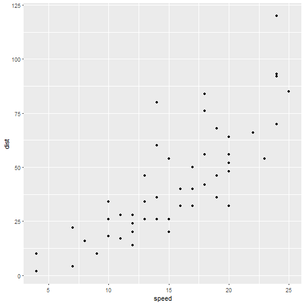

## Una tabla construida en lenguaje de marcadores

| carat|cut       |color |clarity | depth| table| price|    x|    y|    z|
|-----:|:---------|:-----|:-------|-----:|-----:|-----:|----:|----:|----:|
|  0.23|Ideal     |E     |SI2     |  61.5|    55|   326| 3.95| 3.98| 2.43|
|  0.21|Premium   |E     |SI1     |  59.8|    61|   326| 3.89| 3.84| 2.31|
|  0.23|Good      |E     |VS1     |  56.9|    65|   327| 4.05| 4.07| 2.31|
|  0.29|Premium   |I     |VS2     |  62.4|    58|   334| 4.20| 4.23| 2.63|
|  0.31|Good      |J     |SI2     |  63.3|    58|   335| 4.34| 4.35| 2.75|
|  0.24|Very Good |J     |VVS2    |  62.8|    57|   336| 3.94| 3.96| 2.48|

---

## Incluir una gráfica o imagen estática.

Imagen

---

## Un gráfico construido con ggplot2.

